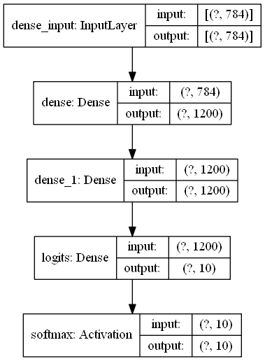
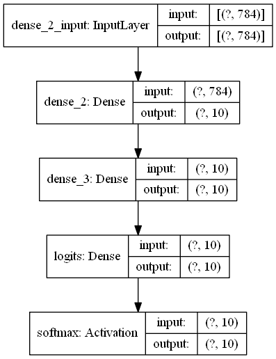
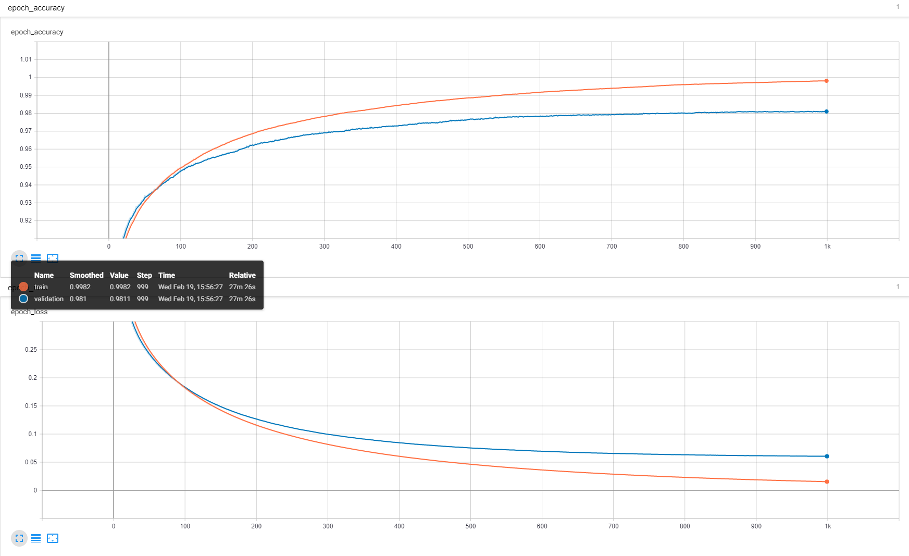
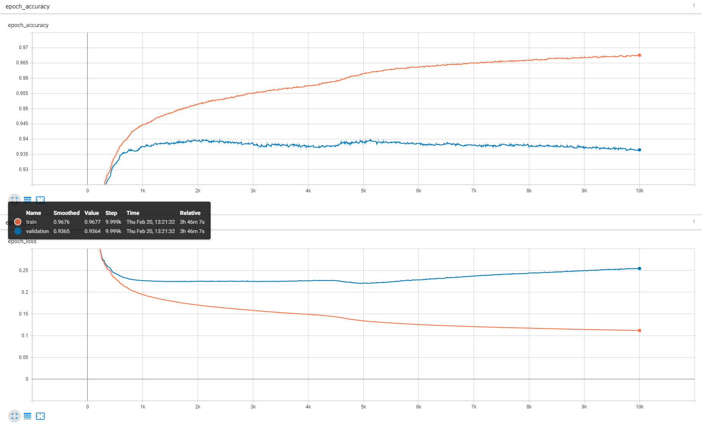
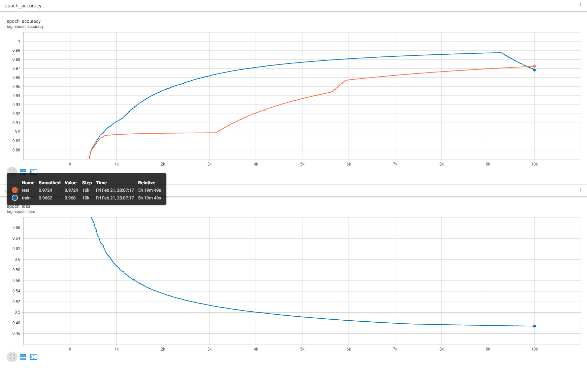
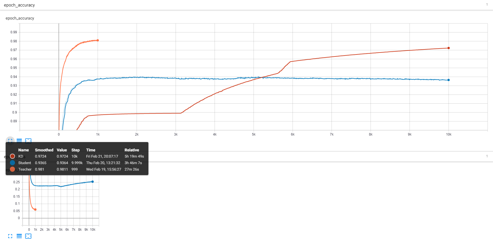

# knowledge_distillation_tensorflow2
Tensorflow2.0 implementation of knowledge distillation.

## Knowledge Distillation review
- I use MNIST dataset.
- Knowledge Distillation trains slower than from scratch method.
- When I use keras.losses.categorical_crossentropy in Keras, Knowledge distillation method led to divergent behaviors. so I made custom loss function(with alpha weight).

---  

## Requirements
- tensorflow 2.0
- python 3
- numpy

---

## Documentation
### Download Dataset
MNIST dataset will be downloaded automatically.
```
(train_images, train_labels), (test_images, test_labels) = tf.keras.datasets.mnist.load_data()
```

### Training Teacher Model
Use `train_teacher.py` to train a teacher network.

### Training Student Model
Use `train_student.py` to train a teacher network.

### Training Teacher Model with KD(Knowledge Distillation)
Use `train_kd.py` to train a teacher network. You have to run after training teacher model. because Knowledge Distillation uses teacher model result.

---

## Model
### Teacher model
<center></center>

### Student model
<center></center>

---

## Results
- optimizer = SGD, learning rate = 0.001
- batch size: 100
- epochs
  - Teacher model: 1K (already saturated result)
  - Student model: 10K

### Teacher Model
<center></center>

- train accuracy: 99.82%
- test accuracy: 98.11%

### Student Model
<center></center>

- train accuracy: 96.77%
- test accuracy: 93.64%

### Student Model with KD
<center></center>

- train accuracy: 96.82%
- test accuracy: 97.24%

### All plot
<center></center>

---

## Reference
 [Geoffrey Hinton, Oriol Vinyals, Jeff Dean. *Distilling the Knowledge in a Neural Network*, NIPS 2014.](https://arxiv.org/abs/1503.02531)
